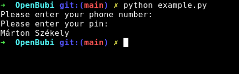

# <p align="center">OpenBubi</p>

## <p align="center"> Open-source module for the Hungarian bike-rental system, MOL Bubi</p>

<p align="center"></p>

### Setup:

- Open up a terminal
- Clone this repository
```bash
git clone https://github.com/piciakk/OpenBubi
```
- Install the requirements
  - Manually
  ```bash
  pip install requests geopy
  ```
  - Automatically
  ```bash
  pip install -r requirements.txt
  ```

### Try it out using a fancy GUI:

*Note: On Ubuntu, you can get a dependency error, (about `tkinter`) when you're trying to run the GUI. If this is the case, run `make`, or (manually) `sudo apt install python3-tk`. (I don't know if this error is present in other distros -> try it for yourself, and maybe start a Pull Request about it)*

- Start the GUI
```bash
python ./gui/login.py
```
- Enter your MOL Bubi credentials
- Enjoy the experience :D

### Module usage:
There you can find a simple guide for using the module.

There are two classes: `BubiUser`, and `BubiMap`. In this tutorial, I'll use these classes.

First of all, make a new python script, that is in the same directory as openbubi.py

Then import the module

```python
import openbubi
```

Then make a new instance of the `BubiUser`, and the `BubiMap` class

```python
# making a BubiUser instance (this takes two arguments)
testUser = openbubi.BubiUser("phoneNumber", "pin")
# Making a BubiMap instance (this takes no argument)
testMap = openbubi.BubiMap()
```

Then print the name of the `testUser` user

```python
print(testUser.getScreenName())
```

With these simple steps, we can make a program that takes a phone number, a pin, and prints out a name

```python
import openbubi
import getpass

phoneNumber = getpass.getpass("Please enter your phone number: ")
pin = getpass.getpass("Please enter your pin: ")

user = openbubi.BubiUser(phoneNumber, pin)
print(user.getScreenName())
```

Run the program

Output:



Congratulations! You've made your first OpenBubi program!

You can read a more technical documentation about the built-in functions [here](https://github.com/PiciAkk/OpenBubi/blob/main/docs/functions.md).

### Notes:

https://futar.bkk.hu/api/query/v1/ws/otp/api/where/bicycle-rental.json?key=bkk-web&version=4

https://futar.bkk.hu/api/query/v1/ws/otp/api/where/bicycle-rental.json?key=bkk-web&version=4&appVersion=3.13.0-58029-74e31c4b

https://api-budapest.nextbike.net/maps/nextbike-live.json?domains=bh

https://api-budapest.nextbike.net/maps/nextbike-live.flatjson?domains=bh

https://api-budapest.nextbike.net/maps/nextbike-official.json?domains=bh

`curl -X POST -F 'mobile=xxx' -F 'pin=xxx' -F 'apikey=Bbx3nGP291xEtDmq' -F 'show_errors=1' -F 'domain=bh' https://api-budapest.nextbike.net/api/v1.1/login.json`

https://github.com/h0chi/nextbike-api-reverse-engineering

---

#### Thanks for the help, [Brúnó Salomon](https://github.com/bru02)
